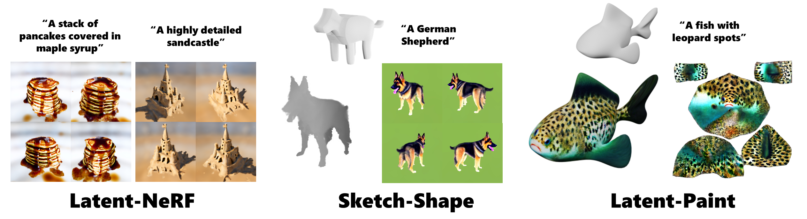

# Latent-NeRF for Shape-Guided Generation of 3D Shapes and Textures

> Text-guided image generation has progressed rapidly in recent years, inspiring major breakthroughs in text-guided shape generation. Recently, it has been shown that using score distillation, one can successfully text-guide a NeRF model to generate a 3D object. We adapt the score distillation to the publicly available, and computationally efficient, Latent Diffusion Models, which apply the entire diffusion process in a compact latent space of a pretrained autoencoder. As NeRFs operate in image space, a naïve solution for guiding them with latent score distillation would require encoding to the latent space at each guidance step. Instead, we propose to bring the NeRF to the latent space, resulting in a Latent-NeRF.
Analyzing our Latent-NeRF, we show that while Text-to-3D models can generate impressive results, they are inherently unconstrained and may lack the ability to guide or enforce a specific 3D structure. To assist and direct the 3D generation, we propose to guide our Latent-NeRF using a Sketch-Shape: an abstract geometry that defines the coarse structure of the desired object. Then, we present means to integrate such a constraint directly into a Latent-NeRF. This unique combination of text and shape guidance allows for increased control over the generation process.
We also show that latent score distillation can be successfully applied directly on 3D meshes. This allows for generating high-quality textures on a given geometry. Our experiments validate the power of our different forms of guidance and the efficiency of using latent rendering.

 
Our three text-guided models: a purely text-guided Latent-NeRF, Latent-NeRF with Sketch-Shape guidance for more exact control over the generated shape, and Latent-Paint for texture generation for explicit shapes. The top row represents the models' inputs.

## Description
Official Implementation for "Latent-NeRF for Shape-Guided Generation of 3D Shapes and Textures"

Code coming soon!

## Recent Updates
`14.11.2022` - Created initial repo

